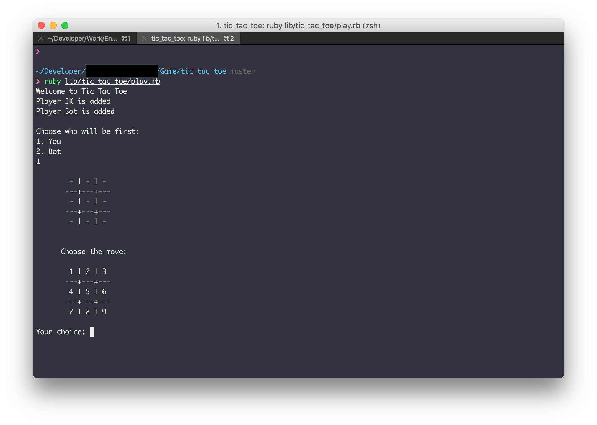

# TicTacToe

This is a Tic Tac Toe game using Minimax Algorithm. I enhance the algorithm using depth refer to this [article]( http://neverstopbuilding.com/minimax)

# How to use it
```bash
# clone the repo
# bundle install the package
bundle
# run the game
ruby lib/tic_tac_toe/play.rb
```


